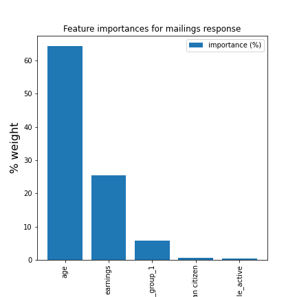

# Email response prediction by ML/AI

## 1.Background
A business would like to use artificial intelligence to improve promotions and marketing by email.

The business goal is to identify those living in large residential area who are most likely to respond. 

This can help them with:

    1. Competitive pricing.
    2. Targeting customers.
    3. Decision making.
    4. Making better strategies.
    

- estimate the timespan for the ML classification pipeline and offer to Olist a reasonable maintenance contract.

## 2. The data

An annotated dataset with a binary target feature: response or not.
This type of data requires supervised machine learning.
The algorithm should be tailored to binary classification. 

## 3. The model outcome

For details, you can consult the full [presentation describing target achievement to the business team](https://github.com/opsabarsec/mailings_response_prediction/blob/main/documents/presentation.pdf)

Below an illustration of the main predictors generated using the Random Forest Classifier algorithm 

## 4. Conclusions

The Random Forest Classifier efficiently predicts the response to mailings with 90 % accuracy and 84 % recall

The ideal resident with highest response probability should be :
- 60-70 years old
- earning 150k / year
- living in the rural area of a specific region/state
- having an active lifestyle

Python code can be found in the following Jupyter notebooks:

[part 1: Data cleaning and exploration](https://github.com/opsabarsec/mailings_response_prediction/blob/main/Notebook1-data-exploration.ipynb)

[part 2: Alghoritms for supervised binary classification](https://github.com/opsabarsec/mailings_response_prediction/blob/main/Notebook2-ML_model_predictions.ipynb)
